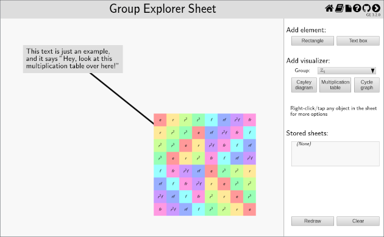
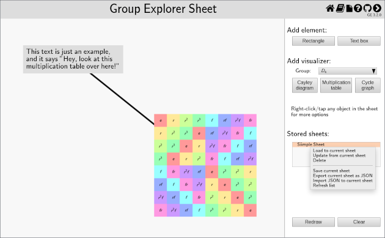
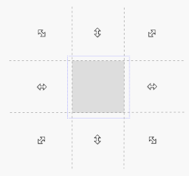
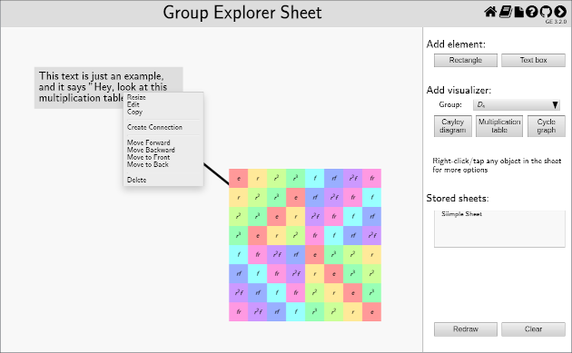
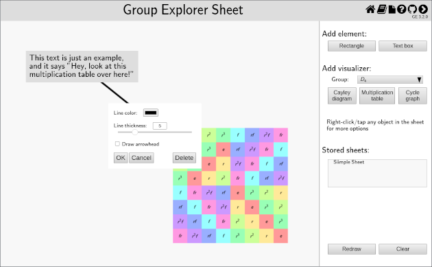

This page describes how to interact with sheets in *Group Explorer*. If you are
unsure what sheets are, [read the description here](rf-geterms.md#sheets). A
blank sheet window looks something like the following picture.

Let us consider all the things one can do with a sheet, grouping them
categorically.

## The sheet itself

A blank sheet is shown as a white region, the left side of the window pictured
above. We'll call this "[display window](#display-window)" in what
follows. In this region you can display "sheet items," rectangular "nodes"
connected by "links". Here is an image of a window containing a sheet with three
items: two nodes, a multiplication table and box of text with a gray background,
and a connecting line linking them together.

The right side of the window, the "[control window](#control-window)," displays
some of the operations you can perform on the sheet. These include creating new
items to add to the display, and loading and storing sheets for later use.
Other operations are available through the context menus of the displayed sheet
items, as [discussed below](#context-menu).

(If the control window isn't visible you can expose it by clicking the
"<b>〈</b>" icon in the upper right-hand menu. If it's visible and you'd like to
devote the entire browser viewport to the display window you can hide the sheet
controls by clicking the "<b>〉</b>" icon.)

If you wish to experiment with a sheet without creating one, there are links in
each group's [Group Info page](rf-um-groupwindow.md) that will create sheets for
you (e.g. "Show me all the views connected together in a sheet" link in the
Views section).

### Dialog boxes and menus

Dialog boxes occur at several points in working with sheets for various reasons.
You can move them around the screen by dragging them with your mouse [or finger]
to a new position. Menu positions are fixed.

Menus may be dismissed without taking any action by clicking somewhere on the
page outside the menu. Diaglog boxes require an explicit action, however, like
pressing a "Cancel" button.

### Dialog inputs

Many of the inputs accepted by Sheet dialogs will be displayed as HTML, not
simply as text. This will be pointed out in the following discussion.  Group
theory nomenclature is filled with subscripts and special characters, and HTML
enables these to be rendered as it is generally seen. Here are a few key points:

* you can use any Unicode character your browser recognizes, like "ℤ" or "⋊"
* you can used HTML entities like "&amp;#x2124;" or "&amp;Zopf;" (equivalent to "ℤ")
* you can use simple inline HTML formatting like "&lt;i>...&lt;/i>" (italicize)
  and "&lt;sub>...&lt;/sub>" (subscript), so "&lt;i>H&lt;/i>&lt;sub>2&lt;/sub>"
  displays as "<i>H</i>2"
* break lines with "&lt;br>", not \n
* be careful of ambiguous uses of "<" and "&"; they must be written as
  "&amp;lt;" and "&amp;amp;", respectively

Some dialogs use both a slider and a textarea to set a configuration value: these
values are synchronized automatically. Thus you can move the slider back and
forth to get a qualitative idea of the parameter's effect on the display, and
you can type in an exact value when you are trying to match another element.

## Control window

### Add element

Click the "Rectangle" button to add a solid gray rectangle to the sheet; click
the "Text box" button to add a small text box to the sheet containing the words
"Enter text." You can [move](#moving) and [resize](#resizing) these items after
they have been placed, including [moving them forward or backwards in the
sheet](#move-forward-backward), as described below.

Rectangles are useful for visually grouping items on the sheet by placing the
rectangle behind them. Text boxes can be useful for labeling items on the sheet
with a caption or an explanation. Both items serve only a visual purpose.

As with all nodes on a sheet, select "Edit" from the item's context menu to
[edit its properties](#rectangle-and-text-box-editor).

### Add visualizer

Clicking one of the "Cayley diagram", "Multiplication table", or "Cycle graph"
buttons will add a copy of the corresponding visualizer to the sheet in the
upper left-hand corner. Choose the group you'd like to visualize from the
drop-down list below the buttons, which offers you a choice of any of the groups
in the *Group Explorer* library (ordered by their number of elements).

You can [move](#moving) and [resize](#resizing) the visualizer much as you do
with other nodes. See the discussion on [visualizer
editing](#visualizer-editor) for further information about configuring the
visualizer.

### Stored sheets

*Group Explorer* can store the sheets you develop and make them available for
viewing at a later time, and it can import and export sheets as strings so you
can share them or store them elsewhere. The stored sheets will persist
even after you have left the *Group Explorer* website, or indeed even after you
have turned your computer off. (They use your browser's "IndexedDB" storage.)

The stored sheets are given names when they're saved, which are displayed like a
list of files under the "Stored sheets" heading. Much like a file browser, when
you right-click [tap] one of sheet names you expose a menu of options, the
"stored sheet menu", as shown in the following picture. (If you click in an area
that doesn't have a sheet name you just get the lower part of the menu. This
will be the case, of course, if you've just started using *Group Explorer* and
haven't created any sheets yet.) We'll discuss the options individually in the
following sections.

#### Create, read, update, delete -- oh CRUD

##### Create

To store the currently displayed sheet under a new sheet name, select "Create"
from the stored sheet menu. A small dialog box will appear prompting you to
enter a name. As explained [above](#dialog-inputs), this name will be
displayed in the list as HTML. Type a name into the window and click "OK" to
accept the name you've provided, or "Cancel" to terminate the operation.  In
either case, the contents of the display window are not affected.

##### Load

To load a stored sheet into the display window, select "Load" from the stored
sheet menu. Any work you had in the display window will be immediately
overwritten by loading the stored sheet.

##### Save

To update a sheet you've already saved with the currently displayed sheet,
select "Save" from the stored sheet menu. The contents of the display window
will immediately overwrite the previously stored sheet of that name, leaving the
display window unchanged.

##### Delete

To delete a sheet you've saved, select "Delete" from the stored sheet menu. The
requisite popup will appear to ask if you're sure.

#### Export and import

*Group Explorer* can export and import stored sheets as JSON strings, so you can
share them or move them between computers.

##### Export from current

To export the currently displayed sheet, select "Export from current" from the
stored sheet menu. A dialog box will appear with a (potentially very long) text
string in its window. You can copy it from the window with your system's
cut-and-paste operation. Changing the text will not affect the displayed sheet.

##### Import to current

To display a JSON string, select "Import to current" from the stored sheet menu.
A dialog box will appear into which you can paste a (potentially very long) JSON
string, such as one generated by a preceeding Export request. The imported
information will immediately overwrite the contents of the display window.

#### Refresh list

This option will reload the names of the stored locally sheets and display the
results in the "Stored sheets" list. This may be useful in the case that two
Sheet tabs are open and a sheet stored in one tab is not reflected in the other.

### Display control

#### Redraw

This button will redraw the current sheet with its original scale and center,
clearing the effects of zooming and panning but retaining the current element
configurations. It is useful after resizing the window, or after zooming in on a
particular feature of a complex sheet.

#### Clear

This button will remove all objects from the sheet and recover its original scale
and center.

## Display window

### Zoom and pan sheet view

Resizing the window containing the sheet does not resize the sheet. If you would
like to zoom in on a particular detail of a complex sheet you can do so with the
mouse wheel or an equivalent scrolling gesture (like a two-fingered drag on a
touchpad). [On a touch platform use a two-finger pinch/spread.] You can also pan
around by right-clicking and dragging the screen. [On touch platforms use a
two-finger drag, like zooming only keeping your fingers the same distance
apart.]

### Moving

Moving a node uses a drag-and-drop pattern familiar from other situations:
left-click on the item and drag [one-touch drag] it to its new position. As you
move the mouse around the sheet you will notice that the cursor changes when
over a node, indicating that the move operation is enabled.

### Resizing

To resize a node you first select it by picking "Resize" from the
context menu, or by left-clicking [touch-holding] the node. Once
selected a light blue outline will appear around the node, and until
it is deselected subsequent operations will affect only that node.
You resize the selected node by dragging [one-finger] its edge.  This
is like resizing a window, except that you don't have to find the edge
of the element to drag it: you can start the drag in the screen
outside the element, as suggested in the picture below.  Just as when
resizing a window, the cursor will change when it's moved around the
screen, reflecting the available operation.  If you start the drag
inside the selected element, it will just reposition the element
without changing its size.

You can also use the wheel (or a scrolling gesture) [pinch/spread on a
touch platform] to expand/contract the element in all directions
equally. Resizing or repositioning the element will not deselect it
and may be done repeatedly.  To deselect the element simply click
[tap] elsewhere in the sheet and the blue outline will disappear.

### Context menu

In addition to direct manipulation of sheet items with the pointer, each node
has a context menu, which can be raised by right-clicking [tapping] the
element. An example of such a menu is shown in the picture below. These
functions operate on the selected element. The context menu can be dismissed by
clicking on the screen away from it. Connecting lines and morphisms do not have
a context menu: right-clicking on them brings up their element editor directly.

#### Copy

Click this button to copy the selected item on the sheet. Another instance of
the same item will immediately appear directly on top of the first instance. You
can then move it to the location you desire.

#### Edit

Each of the sheet items can be further configured with an editor.  Node editors
are brought up by selecting the "Edit" option from their context menu, while
right-clicking [tapping] links brings up their element editors directly.
Selecting "Edit" for a visualizer node opens a new tab in the browser with a
large view of the visualizer, as explained [below](#visualizer-editing).  Other
elements present a modal dialog box in the Sheet tab.  As with other *Group
Explorer* dialog boxes, they may be dragged to a new location.  Changes made in
the dialog boxes are reflected immediately in the displayed sheet.  The dialog
is not dismissed until the changes are accepted with "OK" or reverted by
clicking "Cancel."

##### Rectangle and text box editor

Rectangles and text boxes are very similar: internally, a rectangle is just a
text box without text. (You can even edit a rectangle to add text and turn it
into a text box.) They use the same editor dialog box, shown below for a text
box. By default text box text will be displayed as HTML (see
[above](#dialog-inputs)), but you can override this by checking the
"Display as plain text" box. The font color, size, text alignment, and
background color may also be configured. The background opacity allows you to
adjust the transparency of the node, ranging from completely transparent
(opacity = 0, slider all the way to the left) to solid (opacity = 1).

##### Connection editor

Connecting lines may be configured by right-clicking [tapping] them: the
sensitive area extends the length of the line and is at least a tenth of an
inch wide. As the following picture shows, you can configure the connecting
line's color, width, and whether or not it is drawn with an arrowhead. In
addition to the options of accepting or reverting the changes in the editor,
there is also an button to delete the link entirely.

##### Morphism editor

Editing a morphism is somewhat more involved than editing the other Sheet items,
so there is a separate [help page on editing homomorphisms](rf-um-morphedit.md).

##### Visualizer editing

When you select "Edit" for a visualizer node, rather than presenting you with a
small dialog (as with, say, rectangles or text boxes), *Group Explorer* opens a
new tab in your browser with a large view of the visualizer.  Changes you make
in that large view (such as highlighting elements or changing the viewpoint on a
three-dimensional diagram) will be reflected immediately in the sheet.  You can
close that visualizer tab at any time; changes you make there are continuously
synced to the sheet.

#### Creating links

##### Create connection

To connect one rectangular item in a sheet to another with a straight line,
select "Create Connection" from the first item's context menu. A dialog box will
appear, prompting you to select a valid target for the connection, one that does
not already share another connection or map with the first. Clicking a valid
target will create a new connection, and brings up the connection editor. (The
connection editor is preloaded with the configuration from its last use, so if
you want to create several identical connections just configure the first one
and click "Ok" when asked to edit its successors.) The connection can always be
deleted with connection editor's "Delete" button.

Connections are useful for labelling items in a complex sheet or showing an
intricate network of connections, as in a [lattice of
subgroups](rf-groupterms.md#lattice-of-subgroups).

##### Create map

Connecting one visualizer in a sheet to another with a homomorphism is very
similar to [creating a connection](#create-connection). Select "Create Map" from
the first visualizer's context menu, then select a target visualizer. The target
must not already share a connection or map with the first. Selecting the target
creates the a new map and brings up the morphism editor. For more details, visit
[the help page on editing homomorphisms](rf-um-morphedit.md).

#### Move forward, backward

To move an item forward or backwards on the sheet (i.e. farther into the
background, or closer to the foreground), open the element context menu and
choose "Move forward," "Move backward", "Move to Front," or "Move to Back".
Only nodes can be positioned in this way: the position of a link between nodes
is determined by the positions of the nodes it connects. All connecting lines
lie at the same level below (farther away than) the lowest of any connected
node, so they don't obscure the nodes they connect in a busy sheet like a
[subgroup lattice](rf-groupterms.md#lattice-of-subgroups). (Connecting lines can
be positioned over an unconnected node, however.) By contrast,
[Morphism](rf-groupterms.md#homomorphism) lines are positioned just on top of the
nodes they connect, so you can see the elements they map.

#### Delete

This removes the selected item from the sheet. 

Note that if you delete an item that is connected to another item via a
connecting line or morphism, the connection(s) will also be deleted.

